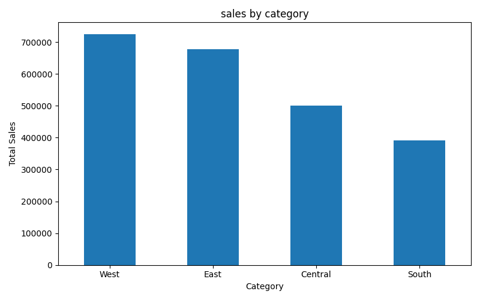
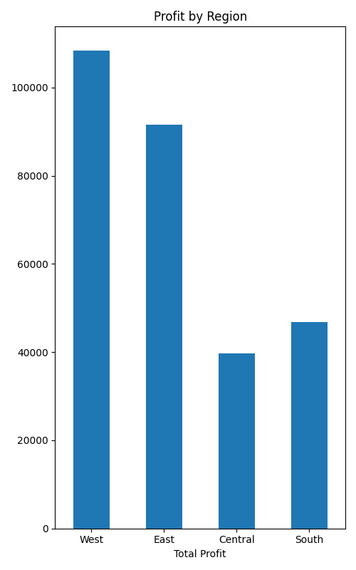
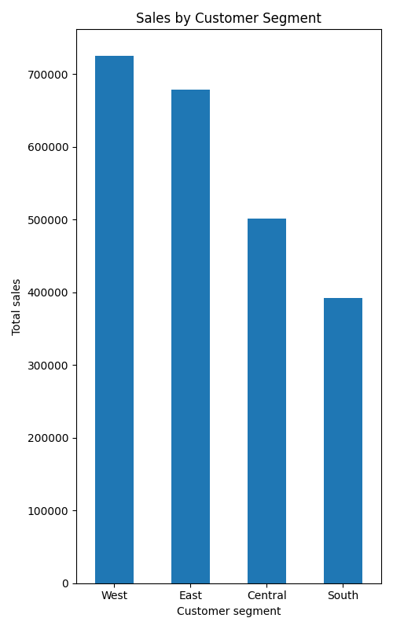
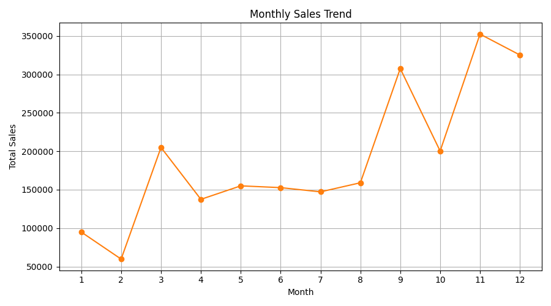
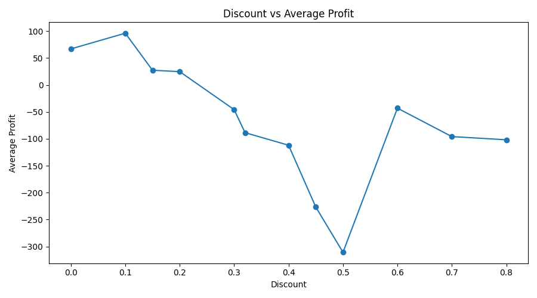
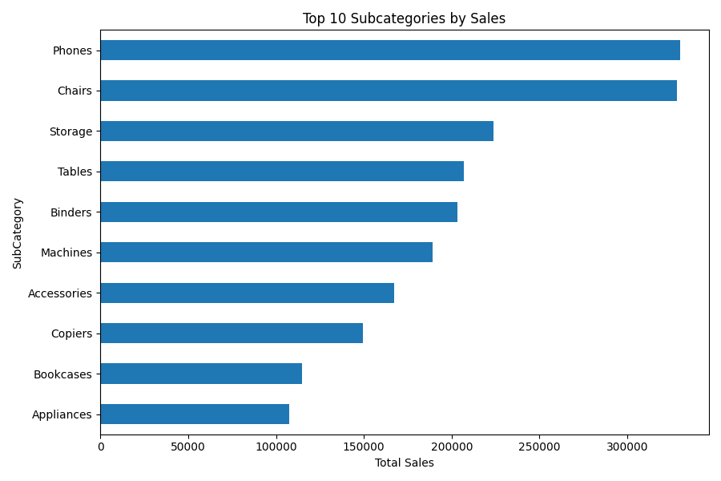

# 📊 Retail Sales Data Analysis & Business Insights

<p align="center">
  <b>Turning retail data into meaningful insights and smarter business decisions.</b>
</p>

---

## 📌 About the Project

This project presents an end-to-end analysis of retail sales data using **Python and data visualization**.

The analysis explores sales, profit, customer segments, regions, product categories, discounts, and sales trends to identify **business opportunities, profitability challenges, and actionable recommendations**.

The project follows a complete data analytics workflow:

**Data Loading → Data Cleaning → Feature Engineering → EDA → Visualization → Business Insights → Recommendations**

---

## 🎯 Project Objectives

- Understand overall retail sales and profitability
- Identify the best-performing product categories
- Analyze regional sales and profit performance
- Compare customer segments
- Study yearly and monthly sales trends
- Analyze the relationship between discounts and profit
- Identify highly profitable and loss-making subcategories
- Generate practical business recommendations

---

## 📈 Key Performance Metrics

| Metric | Value |
|---|---:|
| 💰 Total Sales | **$2,296,919.49** |
| 📊 Total Profit | **$286,409.08** |
| 📦 Total Quantity Sold | **37,871** |
| 🧾 Original Records | **9,994** |
| 🧹 Cleaned Records | **9,993** |

---

## 🔎 Key Business Insights

### 🏆 Technology Leads Performance

**Technology** generated the highest sales and profit among the major product categories, making it an important growth area for the business.

### 🪑 Furniture Has a Profitability Challenge

Furniture generated strong sales but significantly lower profit compared with Technology and Office Supplies.

This indicates an opportunity to review pricing, discounts, product mix, and operational costs.

### 🌎 West is the Strongest Region

The **West** region generated the highest sales and profit.

Its performance can provide useful benchmarks for improving weaker regions.

### 👥 Consumer is the Largest Segment

The **Consumer** segment contributed the highest sales and profit among customer segments.

This makes customer retention and targeted marketing particularly important.

### 📈 Strong Long-Term Sales Growth

Sales increased from approximately **$484K in 2019** to approximately **$733K in 2022**, demonstrating strong overall growth.

### 📅 November is the Peak Sales Month

**November** recorded the highest monthly sales.

This creates an opportunity for advance inventory planning, marketing campaigns, and operational preparation.

### ⚠️ Loss-Making Subcategories

**Tables** and **Bookcases** were among the weakest subcategories in terms of profitability.

These products require further investigation into pricing, discounts, shipping costs, and product economics.

---

## 💡 Business Recommendations

### 1. 🚀 Invest in High-Performing Technology Products
Prioritize inventory and marketing for profitable Technology products while maintaining healthy margins.

### 2. 💰 Improve Furniture Profitability
Review Furniture pricing, discount levels, product mix, and fulfillment costs.

### 3. ⚠️ Investigate Loss-Making Products
Analyze Tables and Bookcases to identify the causes of negative profitability.

### 4. 🏷️ Optimize Discount Strategy
Evaluate discounts based on their effect on **profit**, not sales volume alone.

### 5. 🌎 Learn from the West Region
Identify successful strategies in the West and explore opportunities to apply them to weaker regions.

### 6. 👥 Strengthen Consumer Customer Retention
Develop targeted promotions and loyalty strategies for the Consumer segment.

### 7. 📅 Prepare for Peak Demand
Increase inventory and marketing readiness before high-performing periods such as November.

---

# 📊 Visualizations

### Sales by Category



### Profit by Region



### Sales by Customer Segment



### Monthly Sales Trend



### Discount vs Profit



### Top 10 Subcategories by Sales



---

# 🛠️ Tech Stack

- 🐍 **Python**
- 🐼 **Pandas**
- 📊 **Matplotlib**
- 📓 **Jupyter Notebook**
- 🔧 **Git**
- ☁️ **GitHub**

---

# ▶️ How to Run the Project

## 1. Clone the Repository

```bash
git clone https://github.com/Rahul-codehub/Retail-sales-analysis.git